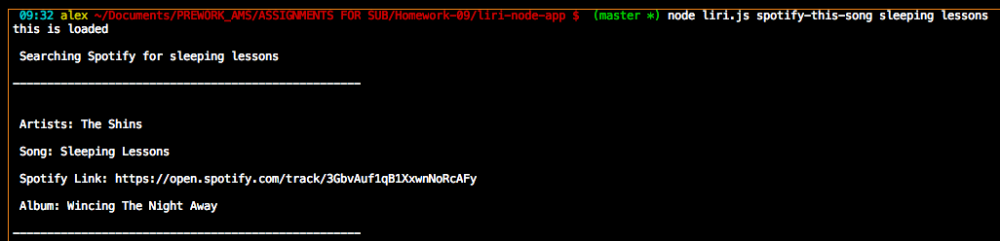

# LIRI Bot
 

## Problem

LIRI is like iPhone's SIRI. However, while SIRI is a Speech Interpretation and Recognition Interface, LIRI is a _Language_ Interpretation and Recognition Interface. LIRI will be a command line node app that takes in parameters and gives you back data.
LIRI will search Spotify for songs, Bands in Town for concerts, and OMDB for movies.

 

## Overview of App Organization

This is a command line interface program

The file liri.js can take in one of the following commands followed by the desired search term:

   * `concert-this`

   * `spotify-this-song`

   * `movie-this`

   * `do-what-it-says`

   * do-what-it-says reads `random.txt` which will run the following command:

     * spotify-this-song,"I Want it That Way"

 

## Run Instructions

If the user inputs `node liri.js concert-this <artist/band name here>`

   * This will search the Bands in Town Artist Events API for an artist and render the following information about each event to the terminal:

     * Name of the venue

     * Venue location

     * Date of the Event ("MM/DD/YYYY")

If the user inputs `node liri.js spotify-this-song '<song name here>'`

   * This will show the following information about the song in your terminal/bash window

     * Artist(s)

     * The song's name

     * A preview link of the song from Spotify

     * The album that the song is from

   * If no song is provided then the program will default to "The Sign" by Ace of Base.

If the user inputs `node liri.js movie-this '<movie name here>'`

   * This will output the following information to your terminal/bash window:

       * Title of the movie.
       * Year the movie came out.
       * IMDB Rating of the movie.
       * Rotten Tomatoes Rating of the movie.
       * Country where the movie was produced.
       * Language of the movie.
       * Plot of the movie.
       * Actors in the movie.

   * If the user doesn't type a movie in, the program will output data for the movie 'Mr. Nobody.'

 

## This App Utilizes

   * [Node-Spotify-API](https://www.npmjs.com/package/node-spotify-api)

   * [Require](https://www.npmjs.com/package/require)

   * [Moment](https://www.npmjs.com/package/moment)

   * [DotEnv](https://www.npmjs.com/package/dotenv)

 

### Bands In Town Example

### Spotify Example

### OMDB Movie Example

 

## Role in Development

My name is Alex I am a bootcamp student whose portfolio can be found
[here.]( https://alexsamalot19.github.io/Samalot-Alexander-Portfolio/)

I designed this app using existing APIs and packages listed in the **This App Utilizes** section. I utilized node js to collect user input data from the command line and collect data from the SDKs. 